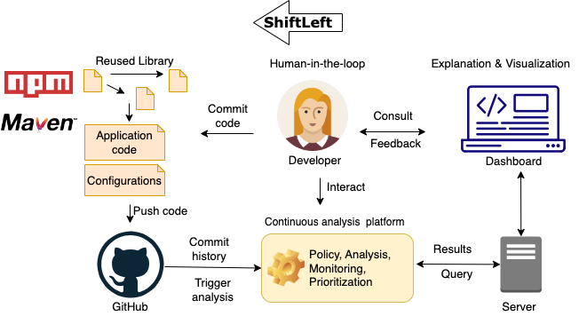

  

# ShiftLeft: Securing the Software Supply Chain by Code-centric Analysis

The ShiftLeft project seeks to transform the security of Software Supply Chains (SSCs) by introducing a declarative code-centric platform supporting continuous security analysis. It incorporates foundational frameworks, novel abstractions combining static and dynamic techniques, and human-in-the-loop feedback with AI-driven prioritization metrics. The project's objectives include developing expressive security models, building a scalable security analysis platform, and creating an open-source security dashboard integrated into the software development lifecycle for real-world SSCs.

ShiftLeft is funded by the  [Wallenberg AI, Autonomous Systems and Software Program (WASP)](https://wasp-sweden.org/) via the [NEST (Novelty, Excellence, Synergy, and Teams) ](https://wasp-sweden.org/calls/call-for-nests-in-cyber-security/) instrument. The project is lead by the PI, Prof. Musard Balliu (KTH Royal Institute of Technology). The co-PIs are Prof. Alexandre Bartel (Umeå University), Prof. Christoph Reichenbach (Lund University), Prof. David Sands and Prof. Rebekka Wohlrab (Chalmers University of Technology). The industrial partners are Cparta Cyber Defense, Debricked, Ericsson, Recorded Futures, and SEB. [Read more](https://wasp-sweden.org/nest-project-shiftleft-securing-the-software-supply-chain-by-code-centric-analysis/) 

# News Corner
- We are excited to host the kickoff workshop for the ShiftLeft project on October 25, 2024, at Cybercampus Sverige. [Read More](./Workshop/KickOff.md)
- [SiKai Lu](https://www.kth.se/profile/sikai) joined the project as a doctoral student. He will be supervised by [Musard Balliu](https://people.kth.se/~musard/).
- [Raffaela Groner](https://www.chalmers.se/en/persons/raffaela/) joined the project as a Postdoctoral researcher hosted by [Rebekka Wohlrab](https://rebekkaa.github.io/).
- ShiftLeft's PI [Rebekka Wohlrab](https://rebekkaa.github.io/) awarded by WASP as [Alumni of the Year 2023](https://wasp-sweden.org/rebekka-wohlrab-wasp-alumni-of-the-year-2023/) for outstanding research in the engineering of self-adaptive systems. Congratulations Rebekka.

# Team ShiftLeft
- Principal Investigators: [Musard Balliu](https://people.kth.se/~musard/), [Alexandre Bartel](https://www.abartel.net/), [Christoph Reichenbach](https://creichen.net/), [David Sands](https://www.cse.chalmers.se/~dave/Homepage_David_Sands/Home.html), [Rebekka Wohlrab](https://rebekkaa.github.io/)
- PostDocs: [Raffaela Groner](https://www.chalmers.se/en/persons/raffaela/), [Timothé Riom](https://www.umu.se/en/staff/timothee-riom/)
- PhD students: [Eric Cornelissen](https://www.kth.se/profile/ericco), [SiKai Lu](https://www.kth.se/profile/sikai), [Mikhail Shcherbakov](https://www.kth.se/profile/mshc), [Erik Söderholm Präntare](https://portal.research.lu.se/sv/persons/erik-s%C3%B6derholm-pr%C3%A4ntare)
- Research assistants: [Diogo Torres Correia](https://www.kth.se/profile/diogotc)

# Open Positions
- We are continuously looking for PhD students, postdocs, and research engineers [Get in touch!](mailto:musard@kth.se,dave@chalmers.se,alexandre.bartel@umu.se,christoph.reichenbach@cs.lth.se,wohlrab@chalmers.se)
- We are looking for a PhD student at Lund University.  Deadline: 30 April 2024 - (Closed)
- We are looking for a PhD student at KTH. Deadline: April 30, 2024 - [Apply now](https://kth.varbi.com/en/what:job/jobID:698123/type:job/where:4/apply:1) (Closed)
- We are looking for a PhD student at Chalmers. Deadline: April 2, 2024 - [Apply now](https://www.chalmers.se/en/about-chalmers/work-with-us/vacancies/?rmpage=job&rmjob=12605&rmlang=GB) (Closed)

# Mailing List
If you are interested in keepping tab on our research, feel free to drop an email to [SiKai Lu](https://www.kth.se/profile/sikai) and ask him to add your name on the mailing list. Also, please don't be hesitant to send an email to [shiftleft@kth.se](mailto:shiftleft@kth.se) if you feel the need of contacting us.

# Publications
- [Unveiling the Invisible: Detection and Evaluation of Prototype Pollution Gadgets with Dynamic Taint Analysis](https://people.kth.se/~musard/research/pubs/www24.pdf) Mikhail Shcherbakov, Paul Moosbrugger, Musard Balliu. The Web Conference (WWW'24), 2024.
- [GHunter: Universal Prototype Pollution Gadgets in JavaScript Runtimes](https://people.kth.se/~musard/research/pubs/usenix24.pdf) Eric Cornelissen, Mikhail Shcherbakov, Musard Balliu. Usenix Security Symposium (Usenix Sec'24), 2024.
- [Analyzing Prerequisites of known Deserialization Vulnerabilities on Java Applications](https://www.abartel.net/static/p/ease2024-javaDeser.pdf) Bruno Kreyßig, Alexandre Bartel. International Conference on Evaluation and Assessment in Software Engineering (EASE'24), 2024.
- [Clog: A Declarative Language for C Static Code Checkers](https://dl.acm.org/doi/pdf/10.1145/3640537.3641579) Alexandru Dura, Christoph Reichenbach. International Conference on Compiler Construction (CC'24), 2024.
- [JavaDL: Automatically Incrementalizing Java Bug Pattern Detection](https://creichen.net/papers/javadl.pdf) Alexandru Dura, Christoph Reichenbach, Emma Söderberg. in Proceedings of the ACM on Programming Languages (OOPSLA'21), 2021

# Software and Datasets
- [Dasty](https://github.com/KTH-LangSec/Dasty)
- [Silent Spring](https://github.com/KTH-LangSec/silent-spring)
- [Dataset of Server-Side Prototype Pollution vulnerabilities](https://github.com/KTH-LangSec/server-side-prototype-pollution)
- [Clog](https://github.com/lu-cs-sde/clog)
- [JavaDL](https://github.com/lu-cs-sde/metadl)
- [ExtendJ Extensible Java Compiler](https://extendj.org/)

# Supporting Institutions

    
  

  

    
  

  

    
  

  

    
  

  

    
  

